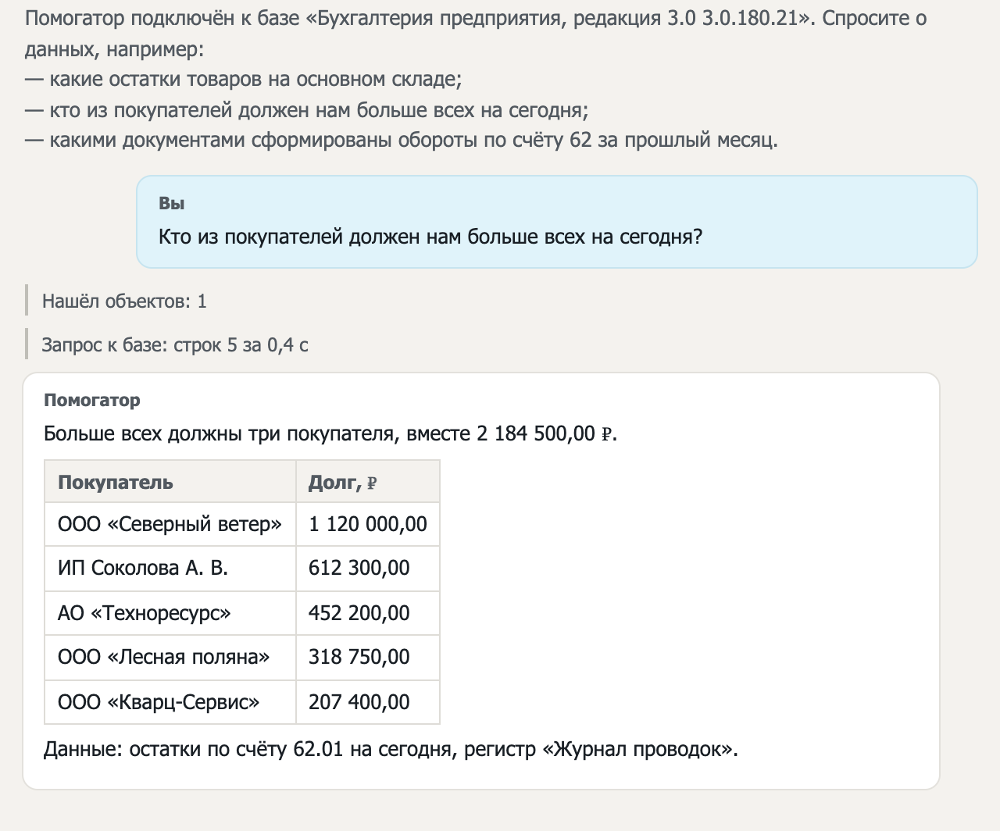
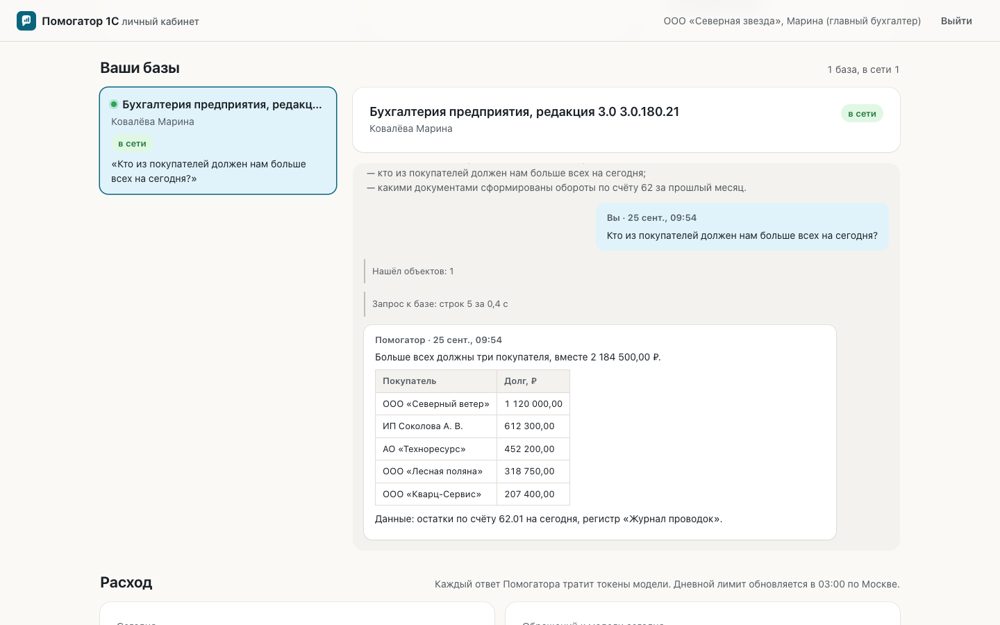
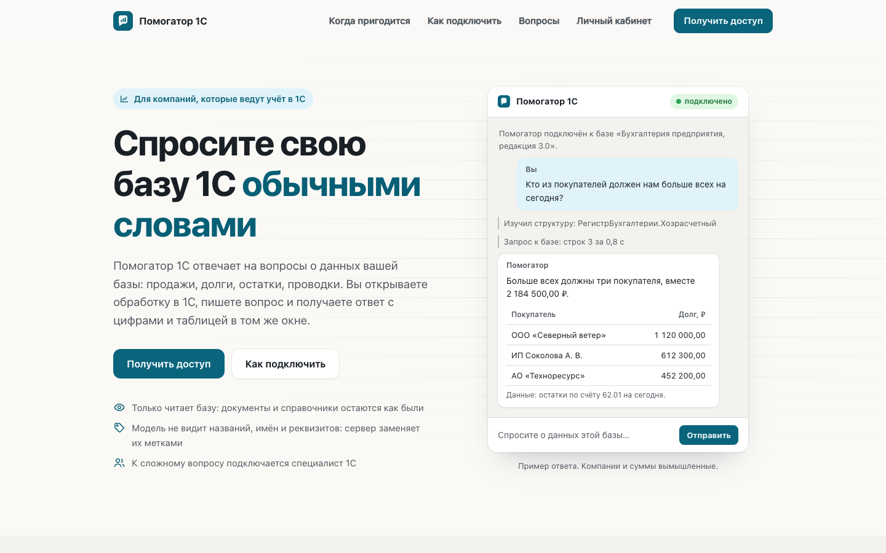

# Помогатор 1С

ИИ-агент для работы с 1С. Вы спрашиваете о данных своей базы обычными словами, а Помогатор сам находит нужные регистры, выполняет запрос и отвечает цифрами и таблицей прямо в окне 1С.

Сейчас идёт пилот: подключаем компании по заявке на [pomogator1c.ru](https://pomogator1c.ru).

## Как это работает

Помогатор подключается к базе через внешнюю обработку 1С. Её открывают в своей базе, вставляют личный ключ и нажимают «Проверить подключение». После этого в обработке открывается чат, и можно задавать вопросы.

- Обработка только читает данные. Создавать, проводить или удалять документы она не умеет.
- Ставить программы на сервер 1С и открывать порты не нужно.
- Названия, имена и реквизиты уходят в языковую модель метками. Настоящие значения видите только вы.
- Под ответом написано, из каких данных и за какой период он посчитан.
- Если вопрос сложный, в том же чате отвечает специалист 1С.
- Историю вопросов и расход видно в личном кабинете.

## Статус

Пилот. Агент уже отвечает в живой базе 1С:Комплексная автоматизация 2. Код закрыт, здесь только описание.
